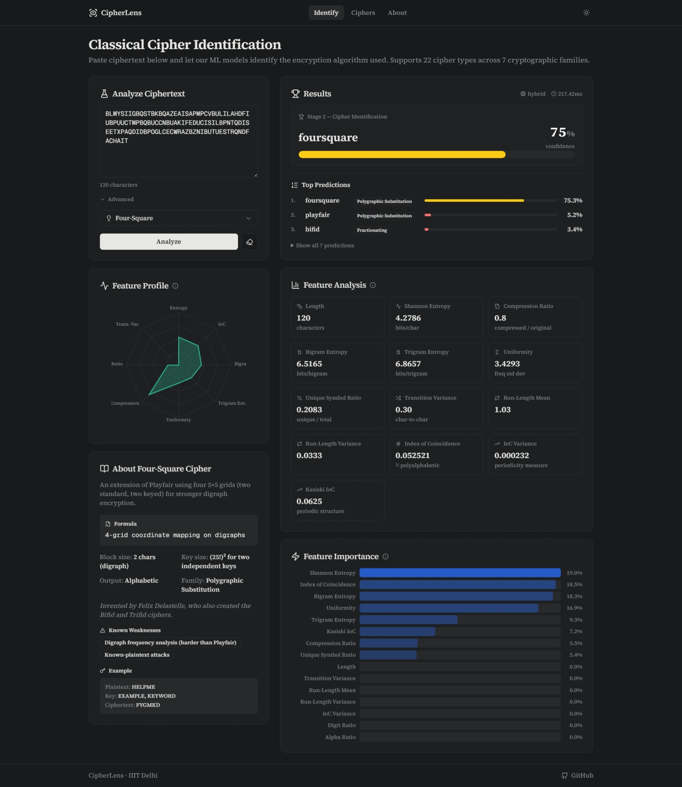
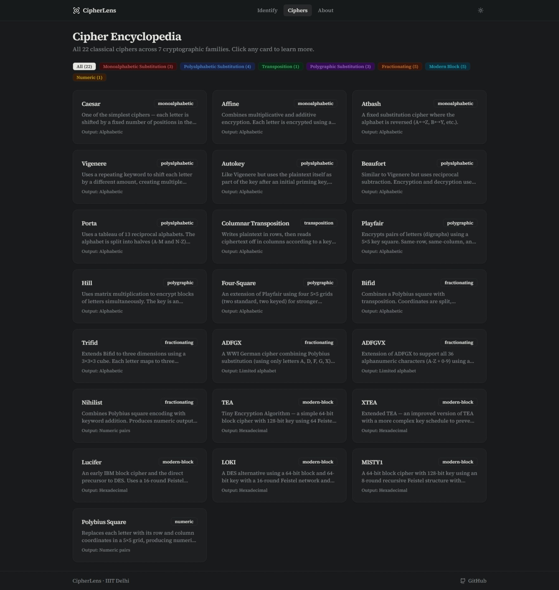
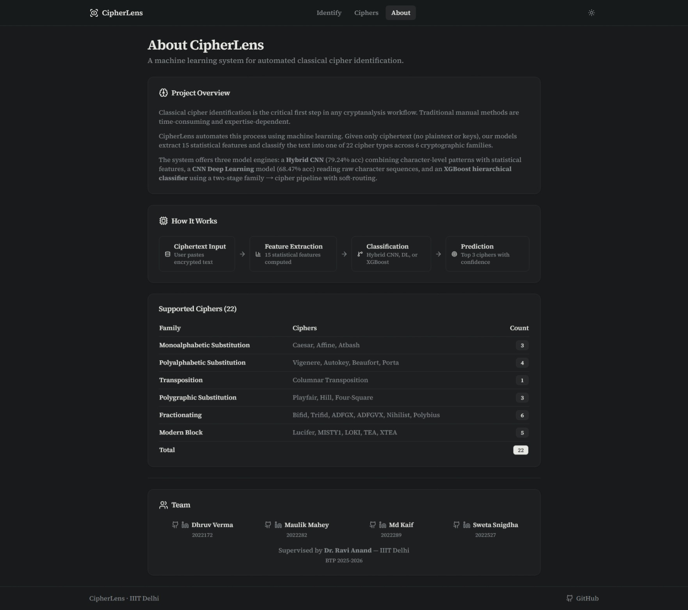

# CipherLens — Classical Cipher Identification

> Paste ciphertext. Get the cipher. No keys, no plaintext needed.

A machine learning web app that identifies **22 classical cipher types** from raw ciphertext using statistical feature extraction and three complementary ML models.

Built as a B.Tech Project at IIIT Delhi, 2025–2026.



<p align="center">
  
  
</p>

---

## Features

- **22 cipher types** across 6 families — monoalphabetic, polyalphabetic, transposition, polygraphic, fractionating, and modern block
- **3 model engines** — Hybrid CNN (best accuracy), DL CNN (fastest), XGBoost (interpretable)
- **15 statistical features** extracted per ciphertext — entropy, IoC, Kasiski analysis, bigram entropy, and more
- **Feature importance** — see which statistical properties drove each prediction
- **Cipher encyclopedia** — descriptions, formulas, and examples for all 22 ciphers

## Models

| Model | Architecture | Val Accuracy | Best For |
|-------|-------------|-------------|----------|
| **Hybrid CNN** | Character CNN + Statistical MLP (dual-input) | 79.24% | Best overall — default |
| **CNN Deep Learning** | Character-level 1D CNN | 68.47% | Fast, no feature engineering |
| **XGBoost** | Two-stage family → cipher with soft-routing | — | Interpretable, near-instant |

Trained on **550,000 samples** (`cipher_MASTER_FULL_V4`, 25k/cipher, MIN\_LEN=100) with 15 statistical features.
Full evaluation in [`docs/FINDINGS.md`](docs/FINDINGS.md).

## Supported Ciphers

| Family | Ciphers | Count |
|--------|---------|-------|
| Monoalphabetic Substitution | Caesar, Affine, Atbash | 3 |
| Polyalphabetic Substitution | Vigenere, Autokey, Beaufort, Porta | 4 |
| Transposition | Columnar Transposition | 1 |
| Polygraphic Substitution | Playfair, Hill, Four-Square | 3 |
| Fractionating | Bifid, Trifid, ADFGX, ADFGVX, Nihilist, Polybius | 6 |
| Modern Block | TEA, XTEA, Lucifer, LOKI, MISTY1 | 5 |
| **Total** | | **22** |

## Tech Stack

| Layer | Technology |
|-------|-----------|
| **Frontend** | Next.js 16, React 19, TypeScript, Tailwind CSS, shadcn/ui, Framer Motion |
| **State** | Zustand |
| **Backend** | FastAPI, PyTorch, XGBoost, scikit-learn |
| **Infra** | Docker Compose, Gunicorn/Uvicorn |

## Quick Start

### With Docker (recommended)

```bash
git clone https://github.com/LordAizen1/cipherlens.git
cd cipherlens
docker compose up -d --build
```

- Frontend: http://localhost:3000
- Backend API + docs: http://localhost:8000/api/docs

> **Note:** Trained model files are not included in the repo. Place them in `backend/app/models/` before building. See [Training](#training) to retrain from scratch.

### Without Docker

```bash
# Backend
cd backend
python -m venv venv && source venv/bin/activate   # Windows: venv\Scripts\activate
pip install -r requirements.txt
uvicorn app.main:app --reload

# Frontend (new terminal)
cd frontend
npm install
npm run dev
```

## Project Structure

```
cipherlens/
├── frontend/
│   └── src/
│       ├── app/          — Pages: Home, /ciphers, /about
│       ├── components/   — UI components
│       ├── hooks/        — Zustand store
│       └── lib/          — API client, types, cipher constants
├── backend/
│   ├── app/
│   │   ├── routers/      — /api/predict, /api/health
│   │   ├── services/     — Feature extraction + 3 inference engines
│   │   └── models/       — Trained .pkl and .pth files (not in git)
│   └── scripts/          — Dataset generation + training scripts
├── data/                 — Dataset CSV (not in git)
├── docs/
│   ├── FINDINGS.md       — Full model evaluation report
│   └── Project_Report.md — BTP project report
├── docker-compose.yml
└── CONTRIBUTING.md
```

## Training

Models were trained on the IIIT Delhi Precision cluster (NVIDIA H100 MIG GPU).

```bash
# 1. Generate dataset (cluster recommended — ~2–3 hrs locally)
python backend/scripts/generate_dataset_v4.py

# 2. Train XGBoost (~2 min, CPU)
cd backend && python scripts/train.py

# 3. Train DL CNN (~5 min, GPU)
python scripts/train_dl.py

# 4. Train Hybrid CNN (~26 min, GPU)
python scripts/train_hybrid.py
```

SLURM job scripts (`train_job.sh`, `train_dl_job.sh`, `train_hybrid_job.sh`) are included for cluster submission.

## Contributing

Contributions are welcome — new ciphers, better models, UI improvements. See [CONTRIBUTING.md](CONTRIBUTING.md) for guidelines.

## Team

| Name | Roll | GitHub | LinkedIn |
|------|------|--------|----------|
| Dhruv Verma | 2022172 | [@dhruv22172](https://github.com/dhruv22172) | [LinkedIn](https://www.linkedin.com/in/dhruvverma2022172/) |
| Maulik Mahey | 2022282 | [@maulik-dot](https://github.com/maulik-dot) | [LinkedIn](https://www.linkedin.com/in/maulik-mahey-952a92260/) |
| Md Kaif | 2022289 | [@LordAizen1](https://github.com/LordAizen1) | [LinkedIn](https://www.linkedin.com/in/mohammadkaif007/) |
| Sweta Snigdha | 2022527 | [@cypherei00](https://github.com/cypherei00) | [LinkedIn](https://www.linkedin.com/in/sweta-snigdha-8549a4255/) |

Supervised by **Dr. Ravi Anand** — IIIT Delhi

## License

MIT
