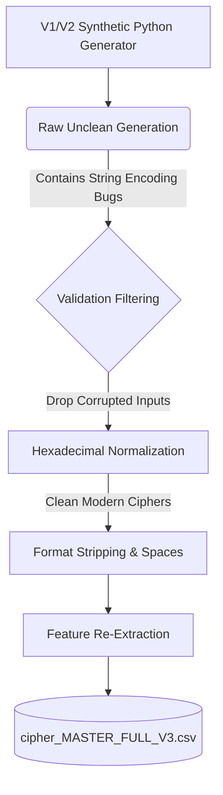
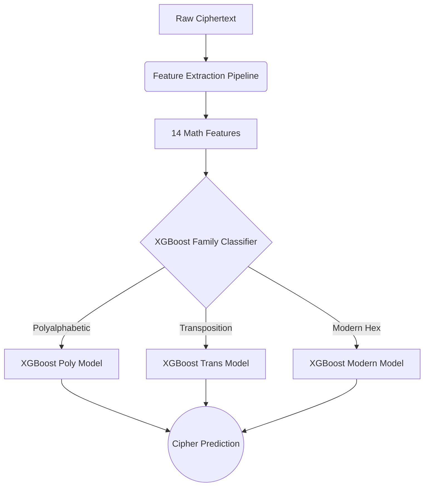
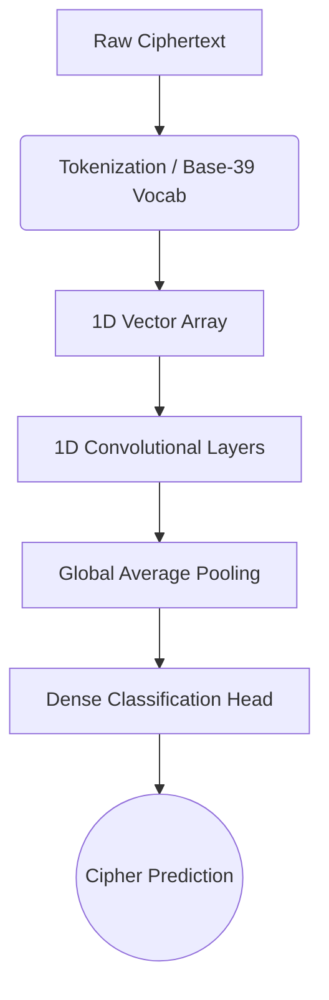
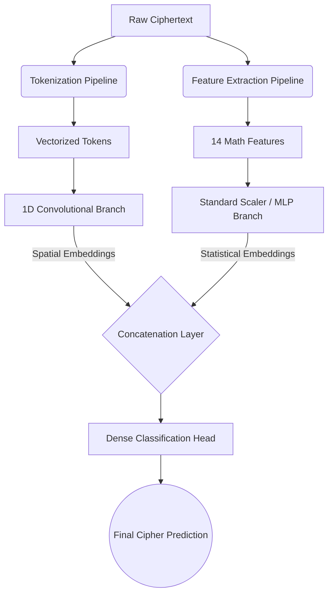

# CipherLens System Architecture & Development Report

This report outlines the engineering journey of the **CipherLens** classification engine, detailing the data pipelines, feature extraction strategies, modeling approaches, and the iterative improvements that culminated in our high-performance Hybrid machine learning model.

---

## 1. Dataset Generation Pipeline
The foundation of any robust NLP or cryptanalysis model is its dataset. 

### Version 1 & 2 (Initial Prototyping)
- **Generation:** Synthetic texts were generated using Python cryptographic algorithms running against natural language corpuses. Texts were generated in various block sizes (50 to 500 characters).
- **Issue Discovered:** Modern cryptographic ciphers (such as TEA, XTEA, and Lucifer) encrypt data into unreadable byte streams. The initial V1/V2 generators incorrectly stored these byte streams as literal Python strings (e.g., `b'\x04\x8a...'`) inside the CSV. This completely broke our statistical feature extractors, as they interpreted the `\x04` as distinct grammatical characters rather than hexadecimal sequences.

### Version 3 (The Clean Pipeline)
To resolve critical string-encoding hallucinations impacting the model's math, we built the V3 Dataset Cleaning Pipeline:
1. **Validation & Filtering:** Iterated over all 330,000+ generated rows, dropping 184 heavily corrupted ones.
2. **Hexadecimal Normalization:** Converted pseudo-bytes strings into clean Hexadecimal representations (e.g., `36555344...`).
3. **Space Stripping:** Ensured ciphers that traditionally do not use spaces (like Nihilist) were formatted correctly.
- **Final Result:** `cipher_MASTER_FULL_V3.csv` containing **329,816 clean, mathematically viable ciphertext samples** across 22 classes.

### Dataset Dataflow Pipeline

---

## 2. Feature Engineering Pipeline
Handcrafted statistical features serve as the backbone for classical machine learning and act as crucial hints for deep learning models. 

### The 14 Key Cryptanalytic Features
1. **Base Features:** `length`, `compression` (zlib ratio to proxy randomness).
2. **Entropy & Distribution:** `entropy`, `bigram_entropy`, `trigram_entropy`, `uniformity` (standard deviation of character frequencies), `unique_ratio`, `transition_var`.
3. **Sequence Lengths:** `run_length_mean`, `run_length_var` (crucial for detecting repetitive blocks in ECB mode or padding).
4. **Classical Cryptanalysis:** `ioc` (Index of Coincidence) and `ioc_variance`.
5. **Composition Context (New in V3):** `digit_ratio`, `alpha_ratio`.

### The Importance Journey
Initially, we relied entirely on 12 features. The models consistently failed (~0% F1 Score) on ciphers like **Polybius** and **Nihilist** because they strictly output numbers (0-9). The classical `ioc` function explicitly ignored digits, evaluating the ciphertexts as empty. 
By introducing `digit_ratio` and `alpha_ratio` for V3, we gave the model the explicit tools needed to cleanly partition classical alphabetic ciphers from modern hex-encoded/fractionating ciphers. This single feature engineering fix boosted Nihilist and Polybius detection from ~0% to 100%.

---

## 3. Modeling Pipeline & Performance Trajectory

### A. Hierarchical XGBoost (Baseline)
- **Pipeline:** Raw Text → [Feature Extractor (14 Features)] → [Family Classifier] → [Specific Cipher Classifier]
- **Training:** Tree-based ensemble trained exclusively on the 14 tabular features.
- **Performance:** **76.43% overall accuracy.** 
- **Limitations:** It struggled heavily with structurally identical ciphers (e.g., Vigenere vs Beaufort) because handcrafted statistical features cannot capture underlying spatial permutations or repeating keys.

### B. Pure 1D-CNN (Deep Learning)
- **Pipeline:** Raw Text → [Tokenization (A-Z, 0-9, Space, Other)] → [1D Convolutional Layers] → [Global Average Pooling] → [Dense Classifier]
- **Training:** PyTorch CrossEntropyLoss with AdamW, learning patterns strictly from character sequences.
- **Performance:** **82.66% overall accuracy.** 
- **Milestone:** The model successfully learned spatial patterns (e.g., block structures and character groupings) but remained ignorant of obvious mathematical rules (like how a perfect `0.0` alpha_ratio instantly guarantees a hex cipher).

### C. Hybrid CNN (The Apex)
- **Pipeline:** Dual-headed architecture unifying deep learning and classical statistics.
- **Training:** PyTorch using `OneCycleLR` scheduling and Label Smoothing to prevent the network from becoming overconfident on ambiguous short texts.
- **Performance:** **87.16% overall accuracy.**
- **The Leap:** By unifying Deep Learning spatial recognition with XGBoost's statistical domain knowledge (entropy/IoC), we achieved perfect 100% precision on Modern Hex Ciphers and Fractionating Ciphers (Polybius, Nihilist).

## 4. Architectural Dataflows

### A. Hierarchical XGBoost Dataflow

### B. Pure 1D-CNN Dataflow

### C. Hybrid CNN Dataflow (Final Architecture)

## 5. UI Integration & Feedback Loop
To cleanly visualize how the models arrive at their conclusions, the frontend utilizes dynamic evaluation:
- For Deep Learning models, the application intentionally notes the spatial learning process.
- For the Hybrid model, an **Input Perturbation Pipeline** dynamically mutes all 14 features iteratively to discover exactly which feature directly caused the model to spike in confidence, producing a real-time, highly accurate Feature Importance chart.
